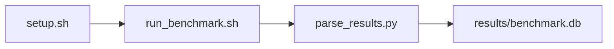

# System Config Verification Benchmark

[](LICENSE)
[](.github/workflows/ci.yml)

Target: Ubuntu 24.04 · AMD · see Hardware Requirements. This is a host benchmark, not a laptop `pip install` project.


## Quick Start

```bash
git clone https://github.com/GaryMichaelBass/sys-bench-amd-rocm-stack-validation.git
cd sys-bench-amd-rocm-stack-validation
bash setup.sh --assume-yes
bash run_benchmark.sh --profile smoke --validate
```

The smoke command runs the configured smoke test (seven ROCm stack probes). Results are written to `results/benchmark.db` and `results/summary.json`.

This workload is local-only and does not support remote SSH execution in `setup.sh` or `run_benchmark.sh`.

### Prerequisites

This is a host benchmark, not a laptop `pip install` project. `setup.sh` needs root or sudo.

- OS: Ubuntu 24.04
- GPU: AMD MI300X, 192GB HBM, gfx942
- ROCm 7.2.1 with rocminfo, rocm-smi, amd-smi, HIP/hipcc, and RVS
- Python 3.12.3




## 1. Overview

This workload analyzes ROCm software stack consistency against yaml expectations. It runs seven ROCm stack probes — `rvs --version`, `rocminfo`, `rocm-smi`, `amd-smi static`, `uname -a`, `modinfo amdgpu`, and `hipcc --version` — then compares package presence, kernel/driver substrings, and `/dev/kfd` plus `/dev/dri/renderD128` permissions to yaml expectations. yaml `rocm_version` is not an exact string compare; DCGM is not invoked. Profile flags do not change which seven tools run. Target hardware is a Digital Ocean `gpu-mi300x1-192gb` droplet with 1x MI300X (192GB HBM, gfx942, 304 CUs).


## 2. What It Validates

Validates ROCm tool presence, amdgpu/kernel substring match, package presence, and GPU device-node permissions.

- ROCm package mismatch count is 0 (all required packages and ROCm tools present).
- Kernel/driver mismatch count is 0 (`uname` prefix 6.8.0 and amdgpu driver substring `6` match).
- Firmware compliance percent is 100.
- Driver compliance percent is 100.
- Permission error count is 0 (`/dev/kfd` and `/dev/dri/renderD128` exist and are readable).


## 3. Metrics Captured

1. **ROCm package mismatch count** — missing required packages plus failed ROCm tool probes — `samples.rocm_package_mismatch_count`
2. **Kernel/driver mismatch count** — kernel prefix or amdgpu driver substring mismatch — `samples.kernel_driver_mismatch_count`
3. **Firmware compliance percent** — firmware presence/compliance percent — `samples.firmware_compliance_percent`
4. **Driver compliance percent** — driver substring compliance percent — `samples.driver_compliance_percent`
5. **Permission error count** — unreadable or missing GPU device nodes — `samples.permission_error_count`


## 4. Hardware Requirements

### Supported environment

A compatible AMD GPU on Ubuntu 24.04 with the ROCm 7.x family and Python 3.12.3. Other GPUs in the same vendor/stack may work but have not been validated against the reference baseline.

- Ubuntu 24.04
- AMD GPU with ROCm 7.x
- Python 3.12.3

### Reference validation environment

The tables below describe the machine used to generate the reference results. They are not a requirement that every user buy that exact cloud instance.

### System

| Component | Specification |
|---|---|
| Provider | Digital Ocean |
| Droplet/instance type | gpu-mi300x1-192gb |
| vCPUs | 20 |
| RAM | 240GB |
| Storage | 720GB NVMe |

### GPU

| Component | Specification |
|---|---|
| GPU Count | 1 |
| GPU Model | MI300X |
| Architecture | gfx942 |
| Compute Units | 304 |
| HBM | 192GB |


## 5. Software Requirements

| Component | Version |
|---|---|
| OS | Ubuntu 24.04 |
| Kernel | kernel 6.8.0 |
| Python | Python 3.12.3 |
| ROCm | ROCm 7.2.1 |
| rocBLAS | N/A - rocBLAS not used |
| Bash | see Installation and Execution Summary |
| SQLite | see Installation and Execution Summary |
| PyYAML | see Installation and Execution Summary |
| rocminfo | see Installation and Execution Summary |
| rocm-smi | see Installation and Execution Summary |
| amd-smi | see Installation and Execution Summary |
| HIP/hipcc | see Installation and Execution Summary |
| RVS | see Installation and Execution Summary |


## 6. Installation

```bash
git clone https://github.com/GaryMichaelBass/sys-bench-amd-rocm-stack-validation.git
cd sys-bench-amd-rocm-stack-validation
sudo bash setup.sh --assume-yes
```

> **Note:**
> - `setup.sh` installs Python venv prerequisites idempotently on fresh Ubuntu images before creating an isolated per-repository environment at the repository-local `.venv` path; do not install benchmark packages into a global Python environment.
> - `BENCHMARK_PYTHON` may select the interpreter used to create that environment (for example `/usr/bin/python3.12`); each repository may use a different interpreter and venv path, and the matching `pythonX.Y-venv` package must be installed.
> - For workload-inherent ROCm tasks, default `bash setup.sh` executes ROCm install steps 1-23 from `scripts/lib/rocm_install.sh` (runtime 1-12, repo 13-17, RVS 18-23) with explicit skip flags as advanced overrides.
> - On first local invocation, `setup.sh` prompts for confirmation that up to two reboots may occur and that setup auto-resumes after each reboot (Enter to continue). `--assume-yes` skips that prompt.
> - `setup.sh` writes a chronological install status file at `results/install_status.txt`, writes bare executed install commands to `results/install_commands.txt`, and keeps a mirrored install-status block in `/etc/motd` during reboot-driven install.
> - During reboot-driven install, `setup.sh` updates `/etc/motd` with in-progress phase/resume status and writes a persistent completion status block when installation is finished.
> - `/etc/motd` should include operator guidance lines: `To see latest status on install, execute the following:` followed by `cat /root/sys-bench-amd-rocm-stack-validation/results/install_status.txt`.
> - On successful local completion, `setup.sh` emits a `wall` broadcast (`setup.sh now complete`).
> - This workload does not install PyTorch or AITER.


## 7. Running the Benchmark

```bash
bash run_benchmark.sh --help
bash run_benchmark.sh --profile smoke --validate
bash run_benchmark.sh --profile smoke --validate --kernel-version 6.8.0 --driver-version 6 --rocm-version 7.2.1 --permissions-check true --output-format csv
BENCHMARK_PYTHON=/usr/bin/python3.12 bash run_benchmark.sh --profile smoke --validate
bash run_benchmark.sh --smoke --validate
bash run_benchmark.sh --baseline --validate
bash run_benchmark.sh --extended --validate
```

`run_benchmark.sh --help` prints the `usage()` page and exits without running setup. `run_benchmark.sh` automatically invokes `scripts/ensure_setup.sh` when `.setup_state` is absent; the operator reruns the command after a reboot-driven setup resumes. A benchmark statistics summary block is printed at the end of a successful run (unless `--quiet` is used), and that summary includes extended statistics (min, max, mean, median, stddev, p95) where applicable.

| Option | Default | Description |
|---|---|---|
| --kernel-version | 6.8.0 | Expected `uname -r` prefix |
| --driver-version | 6 | amdgpu/modinfo substring |
| --rocm-version | 7.2.1 | Documented ROCm expectation |
| --required-packages | yaml | Documentary sweep/list; omit so yaml expands cases |
| --permissions-check | true | Check `/dev/kfd` and renderD128 |
| --output-format | csv | Collector output format |
| --config | config/benchmark_config.yaml | Sweep/threshold yaml |
| --profile | smoke | Profile name |
| --smoke | | Run smoke profile |
| --baseline | | Run baseline profile |
| --extended | | Run extended profile |
| --validate | | Run validator after parse |
| --no-validate | | Skip validator |
| --quiet | | Suppress end-of-run summary |
| --log-level | info | Log verbosity |
| --save-options-file | PATH | Write resolved options |
| --phase | phaseN or N | Resume a named phase |
| --phase1 | | Run phase 1 |
| --phase2 | | Run phase 2 |
| --phase3 | | Parse only; requires --raw-file |
| --phase4 | | Run phase 4 |
| --raw-file | | Existing raw file for phase3 |
| --matrix-definition | | Print this workload's matrix row |
| --help | | Print usage and exit |

**Validating results separately:**

```bash
export BENCHMARK_PYTHON=/usr/bin/python3.13  # optional
python3 -m venv .venv
source ".venv/bin/activate"
".venv/bin/python" scripts/validate_results.py
```


## 8. Output

### `results/benchmark.db` (SQLite)

**`runs`** — one row per `run_benchmark.sh` execution.

| Column | Meaning |
|---|---|
| run_id | Unique run identifier |
| benchmark_id | 101 |
| status | ok/error/timeout/partial |
| started_at | ISO-8601 UTC start |
| finished_at | ISO-8601 UTC stop |
| total_samples | Sweep-point counter |
| passed_samples | Passed sweep-point counter |

**`samples`** — one row per tool probe.

| Column | Meaning |
|---|---|
| run_id | FK to runs |
| sample_index | Probe index |
| status | ok/error |
| kernel_version | Sweep parameter |
| driver_version | Sweep parameter |
| rocm_version | Sweep parameter |
| required_packages | Sweep parameter |
| permissions_check | Sweep parameter |
| output_format | Sweep parameter |
| check_name | Tool probe name |
| rocm_package_mismatch_count | Metric |
| kernel_driver_mismatch_count | Metric |
| firmware_compliance_percent | Metric |
| driver_compliance_percent | Metric |
| permission_error_count | Metric |

### Per-run artifact directory

Each execution writes to `results/raw/YYYYMMDD_HHMMSS_<repo_name>_<hostname>/` and includes at minimum: `run.log`, `commands_executed.sh`, `env_variables.txt`, `journal_warnings.txt` (`journalctl -p warning`, run-window scoped), `script.sh`, raw benchmark dual-format exports (`raw_results.csv`, `raw_results.jsonl`), per-run sample exports in CSV and JSON, raw tool output text, and the Excel-sourced inventory files `hardware_info.txt`, `software_info.txt`, and `errors_info.txt` written into that same per-run directory by `scripts/collect_hw_sw_info.sh` from `config/hw_sw_info_commands.xlsx`. Do not write `system_info.txt`. `errors_info.txt` records unavailable probes without replacing the benchmark result status.

`/root/runtime_ledger.csv` receives one row per invocation. Column order matches `scripts/update_runtime_ledger.py`: `exit_code`, `failure_stage`, `failure_detail`, `raw_run_dir`, hardware/software fields, metric pairs, `run_benchmark_command_submitted`, `run_benchmark_command_fully_resolved`, `Parameter_01_Name`/`Parameter_01_Value` through `Parameter_20_Name`/`Parameter_20_Value`, `parameters_set`, and notes. `total_runtime_mm_ss` is `mm:ss`.

### `results/summary.json`

Consolidated metrics from the most recent run — suitable for CI artifact upload or dashboard ingestion.

### `results/raw/<timestamp>.txt`

Raw collector CSV plus per-tool transcripts (`rvs.txt`, `rocminfo.txt`, `rocm-smi.txt`, and the remaining probe files) for the seven stack checks.


## 9. Baselines / Thresholds

Thresholds live in `config/benchmark_config.yaml` under `thresholds:`.

| Threshold Key | Value | Direction | Basis |
|---|---|---|---|
| rocm_package_mismatch_count_min | 0 | >= | Validation Objective: required packages present |
| rocm_package_mismatch_count_max | 0 | <= | Validation Objective: required packages present |
| kernel_driver_mismatch_count_min | 0 | >= | kernel/driver substring match |
| kernel_driver_mismatch_count_max | 0 | <= | kernel/driver substring match |
| firmware_compliance_percent_min | 100 | >= | firmware compliance |
| firmware_compliance_percent_max | 100 | <= | firmware compliance |
| driver_compliance_percent_min | 100 | >= | driver compliance |
| driver_compliance_percent_max | 100 | <= | driver compliance |
| permission_error_count_min | 0 | >= | device-node permissions |
| permission_error_count_max | 0 | <= | device-node permissions |

To update baselines or thresholds, edit `config/benchmark_config.yaml` — never edit validation code directly.


## 10. Troubleshooting

**`rvs: command not found` / ROCm tools missing**
- **Cause:** ROCm runtime, repo packages, or RVS steps have not completed.
- **Fix:**
```bash
sudo bash setup.sh --assume-yes
```

**`/dev/kfd` missing or permission denied**
- **Cause:** amdgpu/KFD device nodes are absent or not readable after driver install/reboot.
- **Fix:**
```bash
ls -l /dev/kfd /dev/dri/renderD128
sudo bash setup.sh --assume-yes
```

**`kernel_driver_mismatch_count` or compliance percent outside thresholds**
- **Cause:** Live `uname -r` or `modinfo amdgpu` does not contain the yaml kernel/driver tokens, or a probe returned non-zero.
- **Fix:**
```bash
uname -r
modinfo amdgpu | head
".venv/bin/python" scripts/validate_results.py --db results/benchmark.db --config config/benchmark_config.yaml
```

**`.venv` missing or wrong interpreter**
- **Cause:** Setup has not created the repository-local environment, or `BENCHMARK_PYTHON` does not match an installed `pythonX.Y-venv`.
- **Fix:**
```bash
export BENCHMARK_PYTHON=/usr/bin/python3.12
sudo bash setup.sh --assume-yes
```


## 11. NVIDIA H100 Coding Differences

This workload is AMD ROCm stack validation. NVIDIA DCGM is not invoked. An NVIDIA counterpart would probe NVIDIA stack tools rather than rocminfo/rocm-smi/amd-smi/RVS.

## Repository layout

```text
.
├── setup.sh
├── run_benchmark.sh
├── benchmark_specification.json
├── config/
├── scripts/
├── src/
├── tests/
├── docs/
├── results/
└── LICENSE
```

## License

Apache License 2.0. See `LICENSE` and `legal/NOTICE`.
