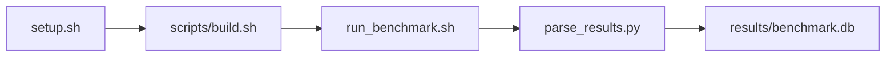

# hipMemcpy Bandwidth Test (H2D, D2H, D2D Benchmark

[](LICENSE)
[](.github/workflows/ci.yml)

Target: Ubuntu 24.04 · AMD · see Hardware Requirements. This is a host benchmark, not a laptop `pip install` project.


## Quick Start

```bash
git clone https://github.com/GaryMichaelBass/gpu-bench-amd-hipmemcpy-transfer-bandwidth.git
cd gpu-bench-amd-hipmemcpy-transfer-bandwidth
bash setup.sh --assume-yes
bash scripts/build.sh
bash run_benchmark.sh --profile smoke --validate
```

The smoke command runs the configured smoke test. Results are written to `results/benchmark.db` and `results/summary.json`.

This workload is local-only and does not support remote SSH execution in `setup.sh` or `run_benchmark.sh`.

### Prerequisites

This is a host benchmark, not a laptop `pip install` project. `setup.sh` needs root or sudo.

- OS: Ubuntu 24.04
- GPU/vendor from Hardware Config: Digital Ocean VM (gpu-mi300x1-192gb,20 vCPUs, 240GB RAM, 720GB NVMe), 1xMI300X(192GB-HBM, gfx942, 304CUs
- ROCm 7.2.1
- Python 3.12.3




## 1. Overview

Compile and run bin/hip_memcpy_bw with yaml direction, pinned_memory, min_bytes, max_bytes, step_factor, and iteration counts, then parse one row per direction and transfer size, to measure HIP copy bandwidth and latency Builds and runs bin/hip_memcpy_bw over yaml transfer sizes and directions. direction, pinned_memory, min_bytes, max_bytes, step_factor, warmup_iters, and num_iterations are forwarded when non-empty. output_format: csv Target hardware: Digital Ocean VM (gpu-mi300x1-192gb,20 vCPUs, 240GB RAM, 720GB NVMe), 1xMI300X(192GB-HBM, gfx942, 304CUs. Implementation components: hipmemcpy-bandwidth-amd, harness-self-check.


## 2. What It Validates

Validates one CSV row per direction and transfer size from bin/hip_memcpy_bw

- Transfer bandwidth, combined H2D/D2H is recorded as `bandwidth_gbps` and satisfies configured yaml gates when present.
- Transfer latency is recorded as `latency_us` and satisfies configured yaml gates when present.
- H2D bandwidth at max size (bandwidth_gbps_h2d is recorded as `h2d_bandwidth_at_max_size_bandwidth_gbps_h2d` and satisfies configured yaml gates when present.


## 3. Metrics Captured

1. **Transfer bandwidth, combined H2D/D2H** — collector/parser field — `samples.bandwidth_gbps`
2. **Transfer latency** — collector/parser field — `samples.latency_us`
3. **H2D bandwidth at max size (bandwidth_gbps_h2d** — collector/parser field — `samples.h2d_bandwidth_at_max_size_bandwidth_gbps_h2d`


## 4. Hardware Requirements

### Supported environment

A compatible AMD GPU on Ubuntu 24.04 with the ROCm family from Framework and Python 3.12.3. Other GPUs in the same vendor/stack may work but have not been validated against the reference baseline.

- Ubuntu 24.04
- AMD GPU with ROCm 7.2.1
- Python 3.12.3

### Reference validation environment

The tables below describe the machine used to generate the reference results. They are not a requirement that every user buy that exact cloud instance.

### System

| Component | Specification |
|---|---|
| Provider | Digital Ocean |
| Droplet/instance type | gpu-mi300x1-192gb |
| vCPUs | 20 |
| RAM | 240GB |
| Storage | 720GB NVMe |

### GPU

| Component | Specification |
|---|---|
| GPU Count | 1 |
| GPU Model | MI300X |
| Architecture | gfx942 |
| Compute Units | 304 |
| HBM | 192GB |


## 5. Software Requirements

| Component | Version |
|---|---|
| OS | Ubuntu 24.04 |
| Kernel | kernel 6.8.0 |
| Python | Python 3.12.3 |
| ROCm | ROCm 7.2.1 |
| rocBLAS | N/A - rocBLAS not used |
| PyYAML | see Installation and Execution Summary |
| C/C++ | see Installation and Execution Summary |
| HIP/ROCm | see Installation and Execution Summary |
| HIPCC | see Installation and Execution Summary |


## 6. Installation

```bash
git clone https://github.com/GaryMichaelBass/gpu-bench-amd-hipmemcpy-transfer-bandwidth.git
cd gpu-bench-amd-hipmemcpy-transfer-bandwidth
sudo bash setup.sh --assume-yes
```

> **Note:**
> - `setup.sh` installs Python venv prerequisites idempotently on fresh Ubuntu images before creating an isolated per-repository environment at the repository-local `.venv` path; do not install benchmark packages into a global Python environment.
> - `BENCHMARK_PYTHON` may select the interpreter used to create that environment (for example `/usr/bin/python3.12`); each repository may use a different interpreter and venv path, and the matching `pythonX.Y-venv` package must be installed.
> - For workload-inherent ROCm tasks, default `bash setup.sh` executes ROCm install steps 1-23 from `scripts/lib/rocm_install.sh` (runtime 1-12, repo 13-17, RVS 18-23) with explicit skip flags as advanced overrides.
> - On first local invocation, `setup.sh` prompts for confirmation that up to two reboots may occur and that setup auto-resumes after each reboot (Enter to continue). `--assume-yes` skips that prompt.
> - `setup.sh` writes a chronological install status file at `results/install_status.txt`, writes bare executed install commands to `results/install_commands.txt`, and keeps a mirrored install-status block in `/etc/motd` during reboot-driven install.
> - During reboot-driven install, `setup.sh` updates `/etc/motd` with in-progress phase/resume status and writes a persistent completion status block when installation is finished.
> - `/etc/motd` should include operator guidance lines: `To see latest status on install, execute the following:` followed by `cat /root/gpu-bench-amd-hipmemcpy-transfer-bandwidth/results/install_status.txt`.
> - On successful local completion, `setup.sh` emits a `wall` broadcast (`setup.sh now complete`).


## 7. Running the Benchmark

```bash
bash run_benchmark.sh --help
bash run_benchmark.sh --profile smoke --validate
bash run_benchmark.sh --profile smoke --validate --device-id 0 --direction all --pinned-memory true --min-bytes 1024 --max-bytes 4096 --step-factor 2 --warmup-iters 1 --num-iterations 3
BENCHMARK_PYTHON=/usr/bin/python3.12 bash run_benchmark.sh --profile smoke --validate
bash run_benchmark.sh --smoke --validate
bash run_benchmark.sh --baseline --validate
bash run_benchmark.sh --extended --validate
```

`run_benchmark.sh --help` prints the `usage()` page and exits without running setup. `run_benchmark.sh` automatically invokes `scripts/ensure_setup.sh` when `.setup_state` is absent; the operator reruns the command after a reboot-driven setup resumes. A benchmark statistics summary block is printed at the end of a successful run (unless `--quiet` is used), and that summary includes extended statistics (min, max, mean, median, stddev, p95) where applicable.

| Option | Default | Description |
|---|---|---|
| --device-id | 0 | Profile parameter `device_id` |
| --direction | all | Profile parameter `direction` |
| --pinned-memory | true | Profile parameter `pinned_memory` |
| --min-bytes | 1024 | Profile parameter `min_bytes` |
| --max-bytes | 4096 | Profile parameter `max_bytes` |
| --step-factor | 2 | Profile parameter `step_factor` |
| --warmup-iters | 1 | Profile parameter `warmup_iters` |
| --num-iterations | 3 | Profile parameter `num_iterations` |
| --config | config/benchmark_config.yaml | Sweep/threshold yaml |
| --profile | smoke | Profile name |
| --smoke | | Run smoke profile |
| --baseline | | Run baseline profile |
| --extended | | Run extended profile |
| --validate | | Run validator after parse |
| --no-validate | | Skip validator |
| --quiet | | Suppress end-of-run summary |
| --log-level | info | Log verbosity |
| --save-options-file | PATH | Write resolved options |
| --phase | phaseN or N | Resume a named phase |
| --phase1 | | Run phase 1 |
| --phase2 | | Run phase 2 |
| --phase3 | | Parse only; requires --raw-file |
| --phase4 | | Run phase 4 |
| --raw-file | | Existing raw file for phase3 |
| --matrix-definition | | Print this workload's matrix row |
| --help | | Print usage and exit |

**Validating results separately:**

```bash
export BENCHMARK_PYTHON=/usr/bin/python3.13  # optional
python3 -m venv .venv
source ".venv/bin/activate"
".venv/bin/python" scripts/validate_results.py
```


## 8. Output

### `results/benchmark.db` (SQLite)

**`runs`** — one row per `run_benchmark.sh` execution.

| Column | Meaning |
|---|---|
| run_id | Unique run identifier |
| benchmark_id | 114 |
| status | ok/error/timeout/partial |
| started_at | ISO-8601 UTC start |
| finished_at | ISO-8601 UTC stop |
| total_samples | Sweep-point counter |
| passed_samples | Passed sweep-point counter |

**`samples`** — one row per parameter combination swept.

| Column | Meaning |
|---|---|
| run_id | FK to runs |
| sample_index | Sweep index |
| status | ok/error |
| device_id | Sweep parameter |
| direction | Sweep parameter |
| pinned_memory | Sweep parameter |
| min_bytes | Sweep parameter |
| max_bytes | Sweep parameter |
| step_factor | Sweep parameter |
| warmup_iters | Sweep parameter |
| num_iterations | Sweep parameter |
| bandwidth_gbps | Metric |
| latency_us | Metric |
| h2d_bandwidth_at_max_size_bandwidth_gbps_h2d | Metric |

### Per-run artifact directory

Each execution writes to `results/raw/YYYYMMDD_HHMMSS_<repo_name>_<hostname>/` and includes at minimum: `run.log`, `commands_executed.sh`, `env_variables.txt`, `journal_warnings.txt` (`journalctl -p warning`, run-window scoped), `script.sh`, raw benchmark dual-format exports (`raw_results.csv`, `raw_results.jsonl`), per-run sample exports in CSV and JSON, raw tool output text, and the Excel-sourced inventory files `hardware_info.txt`, `software_info.txt`, and `errors_info.txt` written into that same per-run directory by `scripts/collect_hw_sw_info.sh` from `config/hw_sw_info_commands.xlsx`. Do not write `system_info.txt`. `errors_info.txt` records unavailable probes without replacing the benchmark result status.

`/root/runtime_ledger.csv` receives one row per invocation. Column order matches `scripts/update_runtime_ledger.py`, including `total_runtime_mm_ss` as `mm:ss`, hardware/software fields, metric pairs, `run_benchmark_command_submitted`, `run_benchmark_command_fully_resolved`, `Parameter_01_Name`/`Parameter_01_Value` through `Parameter_20_Name`/`Parameter_20_Value`, `parameters_set`, and notes.

### `results/summary.json`

Consolidated metrics from the most recent run — suitable for CI artifact upload or dashboard ingestion.

### `results/raw/<timestamp>.txt`

Raw collector output consistent with binary stdout plus a CSV row per direction and size.


## 9. Baselines / Thresholds

Expected ranges live in `config/benchmark_config.yaml` under `baselines:` when published. No numeric published baseline was provided for every metric.

To update baselines or thresholds, edit `config/benchmark_config.yaml` — never edit validation code directly.


## 10. Troubleshooting

**`setup.sh` reports missing ROCm tools**
- **Cause:** ROCm runtime/repository steps have not completed on this host.
- **Fix:**
```bash
sudo bash setup.sh --assume-yes
```

**Collector or parser records status=error**
- **Cause:** A required tool from Framework is missing or produced unparseable output.
- **Fix:**
```bash
bash run_benchmark.sh --profile smoke --validate
```

**Threshold or baseline validation failed**
- **Cause:** A metric is missing, non-finite, or outside `config/benchmark_config.yaml` gates.
- **Fix:**
```bash
".venv/bin/python" scripts/validate_results.py --db results/benchmark.db --config config/benchmark_config.yaml
```

**`.venv` missing or wrong interpreter**
- **Cause:** Setup has not created the repository-local environment.
- **Fix:**
```bash
export BENCHMARK_PYTHON=/usr/bin/python3.12
sudo bash setup.sh --assume-yes
```


## 11. NVIDIA H100 Coding Differences

This is an AMD ROCm workload. An NVIDIA counterpart would use CUDA/DCGM tooling rather than the ROCm probes listed in Framework.

## Repository layout

```text
.
├── setup.sh
├── run_benchmark.sh
├── benchmark_specification.json
├── config/
├── scripts/
├── src/
├── tests/
├── docs/
├── results/
└── LICENSE
```

## License

Apache License 2.0. See `LICENSE` and `legal/NOTICE`.
